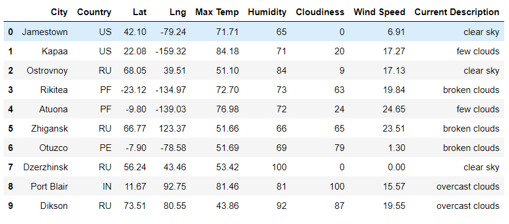

#### Challenge 6: Module 6

# Overview of the Project

Challenge 6 focuses on working on some updates for the PlanMyTrip app, created during Module 6. One of the modifications for the app is adding a weather description for the weather data already obtained. To identify some travel destinations and hotels, input statements are required to filter the data so users can select their weather preferences. Also, the user should be able to choose four cities from the destinations given for a travel itinerary and a travel route between the chosen cities with a marker layer map with Google Maps Directions API.

The First Part focuses on creating random data to obtain different cities with those data referring to their latitude and longitude. The cities have their corresponding description as can be seen in Image 1. The data goes to a data frame and then the data frame is saved as a csv file.

###### Image 1. Weather Data Base.

The Second Part requires the user to insert the maximum and minimum temperature values to use them as a filter. The filter involves just selecting the cities that are within the temperature range. The next section requires generating a map using “gmaps” to show the user the possible options. Then the user selects four cities and another map is generated to see the complete travel route between those cities and their important info.
